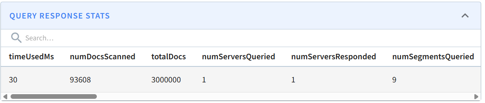

# Basic setup

Understand the content of [ingest schema file](ingest_kafka_schema.json) and [table creation file](ingest_kafka_realtime_table.json). Then, navigate to Apache Pinot's Web UI and add a table schema and a realtime table. 

Navigate to ```Query Console``` and run your first query:

```
select * from ingest_kafka
```

More advanced query:

```
SELECT source_ip, COUNT(*) AS match_count FROM ingest_kafka
WHERE
  content LIKE '%vulnerability%' AND severity = 'High'
GROUP BY source_ip
ORDER BY match_count DESC    
```

See more about queries' syntax: https://docs.pinot.apache.org/users/user-guide-query

*What are we missing when we execute the queries?*
-> No producers are publishing messages to Kafka yet, so Pinot has nothing to ingest. There are no data records in the tables yet. 

See how to ingest data on Apache Pinot: https://docs.pinot.apache.org/manage-data/data-import

# Load generator
Inside the ```load-generator``` folder, understand the content of the docker compose file and start generating log records: 
```bash
docker compose up -d
```
Run again the advanced query:

```
SELECT source_ip, COUNT(*) AS match_count FROM ingest_kafka
WHERE
  content LIKE '%vulnerability%' AND severity = 'High'
GROUP BY source_ip
ORDER BY match_count DESC    
```

*How does this last, advanced query relate to the Spark Structured Streaming logs processing example from Exercise 3?*

The query does essentially the same work as the python configuration we did for Spark Structured Streaming Logs. I would prefer this SQL-form as 
1. I am more familiar with SQL than with Sparks Python API
2. It looks way more compressed and easier to edit. 


*Practical Exercise*: From the material presented in the previous lecture on ``` Analytical Processing``` and Apache Pinot's features (available at https://docs.pinot.apache.org/ ), analyze and explain how the performance of the advanced query could be improved without demanding additional computing resources. Then, implement and demonstrate such an approach in Apache Pinot.

We need to have a look at what makes the query actually slow. It turns out that the LIKE comparison is extremely slow, all the other aggregations/operations are ok in terms of the time they take. 

With 3,000,000 records in the table, the whole query takes about 3 seconds to execute. When removing the LIKE comparison from the WHERE, the query executes within 150 ms, indicating that this statement is the reason for the long execution time. 

We can optimize that by using indices or (materialized) views. 

As we did in the lecture, I decided to do an index on the colum "content". The new query is: 
```sql 
SELECT source_ip, COUNT(*) AS match_count FROM ingest_kafka_fts
WHERE
  TEXT_MATCH(content, 'vulnerability') AND severity = 'High'
GROUP BY source_ip
ORDER BY match_count DESC 
```

Executing this now takes only 30 to 50 ms: 


*Foundational Exercise*: Considering the material presented in the lecture ``` NoSQL - Data Processing & Advanced Topics``` and Apache Pinot's concepts https://docs.pinot.apache.org/basics/concepts and architecture https://docs.pinot.apache.org/basics/concepts/architecture, how an OLAP system such as Apache Pinot relates to NoSQL and realizes Sharding, Replication, and Distributed SQL?

NoSQL follows the BASE principle: basically available, soft state, eventual consistency. The system "sacrifices" consistency for availability (eventually consistent). The state of the system could change over time, it is always "soft". 

Also Apache Pinot states to be highly available and allowing for dynamic configuration changes. 

NoSQL databases are normally scaled horizontally, distributing the documents over the nodes, what also holds for Apache Pinot. There the data is divided into segments that are distributed across server nodes. Each server owns a subset of segments. 

Regarding replication in Apache Pinot, each segment has multiple replicas that are placed on different servers. 

When a query is issued, the broker receives the query and runs sub-queries on the relevant servers to get the information. The servers execute these queries locally on their segments. The broker merges the partial results, and returns the final result to the client. 

In the case of multi-stage queries, the broker is responsible for computing a complete query plan and distribute it to the servers required to execute it. 

## Expected Deliverables

Complete answers to all questions above, including brief analyses, configuration files, and performance metrics for the practical exercise.